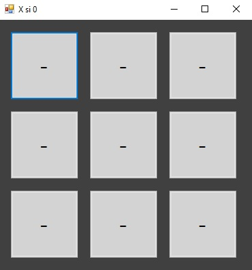
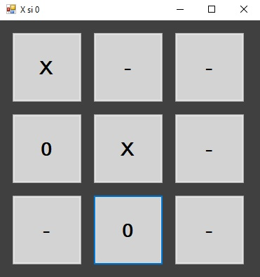
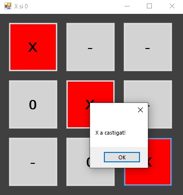

# TicTacToe

- This project is an implementation of TicTacToe in C#.
- It was created by me, using Windows Forms Application in Visual Studio.

The app is pretty simple with a single window and 9 buttons which initially are not setted like in the picture below.

When the user presses a button the button displays if it is a Cross or a Nought.

When a player wins the app highlights the line, column or diagonal which is full of Crosses or Noughts.

